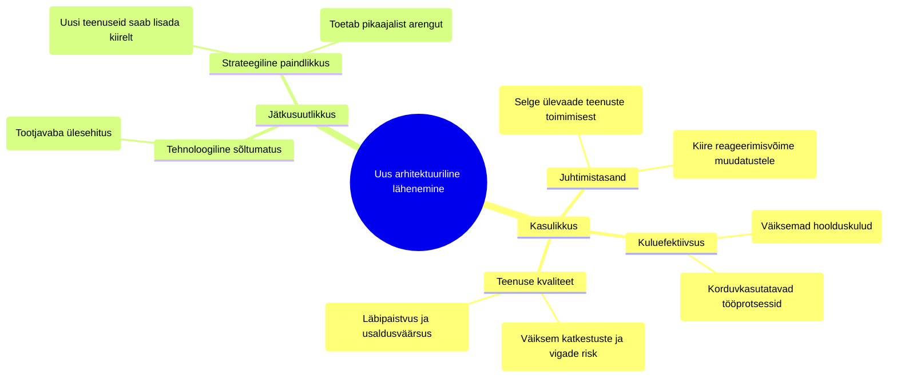

```mermaid
mindmap
  root((Uus arhitektuuriline lähenemine))
    Kasulikkus
      Juhtimistasand
        (Selge ülevaade teenuste toimimisest)
        (Kiire reageerimisvõime muudatustele)
      Kuluefektiivsus
        (Väiksemad hoolduskulud)
        (Korduvkasutatavad tööprotsessid)
      Teenuse kvaliteet
        (Väiksem katkestuste ja vigade risk)
        (Läbipaistvus ja usaldusväärsus)
    Jätkusuutlikkus
      Tehnoloogiline sõltumatus
        (Tootjavaba ülesehitus)
      Strateegiline paindlikkus
        (Uusi teenuseid saab lisada kiirelt)
        (Toetab pikaajalist arengut)
```
