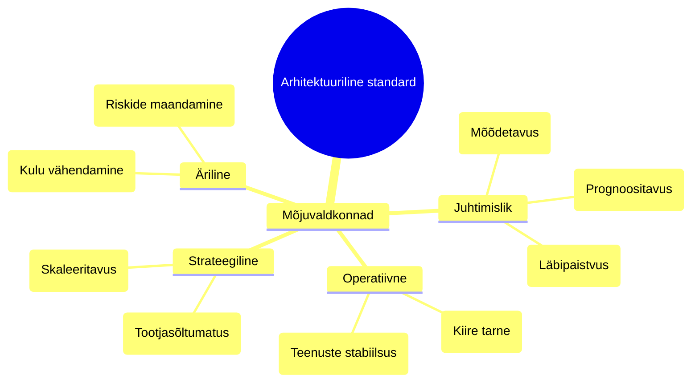

```mermaid
mindmap
  root((Arhitektuuriline standard))
    Mõjuvaldkonnad
      Äriline
        (Kulu vähendamine)
        (Riskide maandamine)
      Juhtimislik
        (Mõõdetavus)
        (Läbipaistvus)
        (Prognoositavus)
      Operatiivne
        (Kiire tarne)
        (Teenuste stabiilsus)
      Strateegiline
        (Skaleeritavus)
        (Tootjasõltumatus)
```
