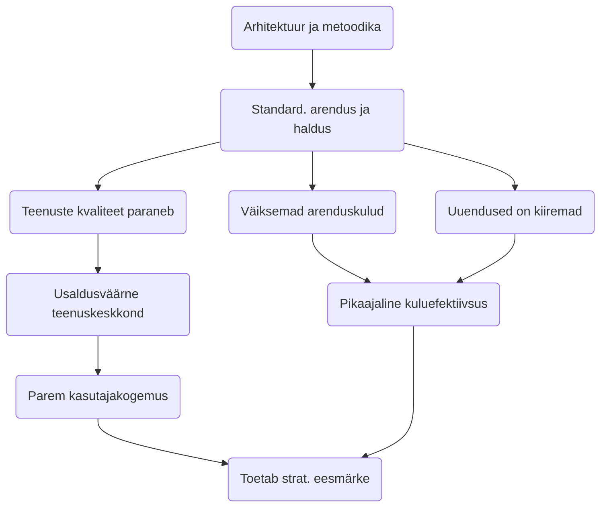

```mermaid
graph TD
  A(Arhitektuur ja metoodika) --> B(Standard. arendus ja haldus)
  B --> C1(Teenuste kvaliteet paraneb)
  B --> C2(Väiksemad arenduskulud)
  B --> C3(Uuendused on kiiremad)

  C1 --> D1(Usaldusväärne teenuskeskkond)
  D1 --> E1(Parem kasutajakogemus)
  E1 --> F(Toetab strat. eesmärke)

  C2 --> D2(Pikaajaline kuluefektiivsus)
  C3 --> D2
  D2 --> F
```
