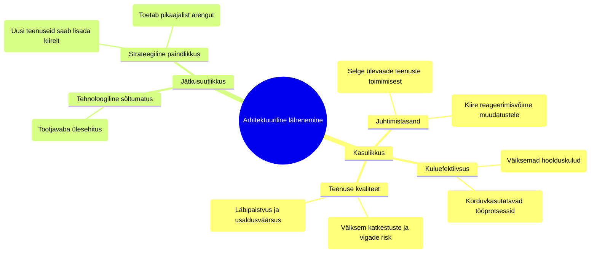
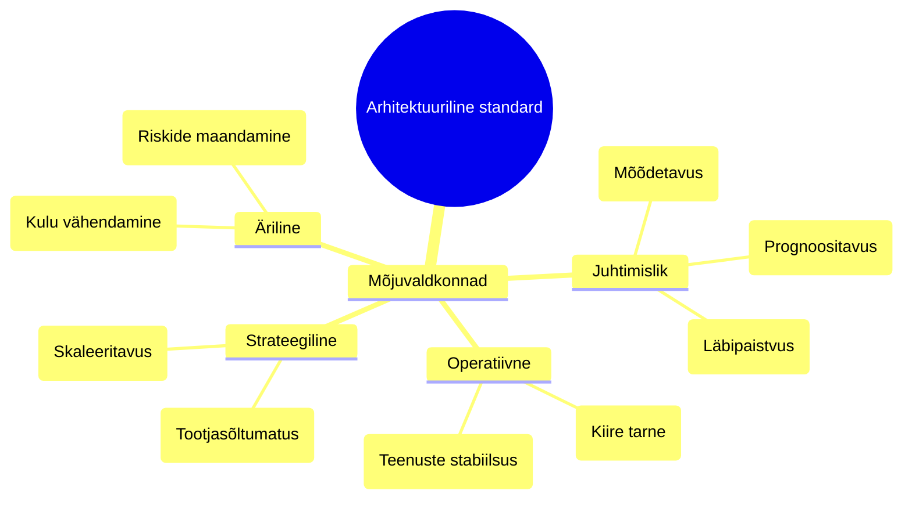
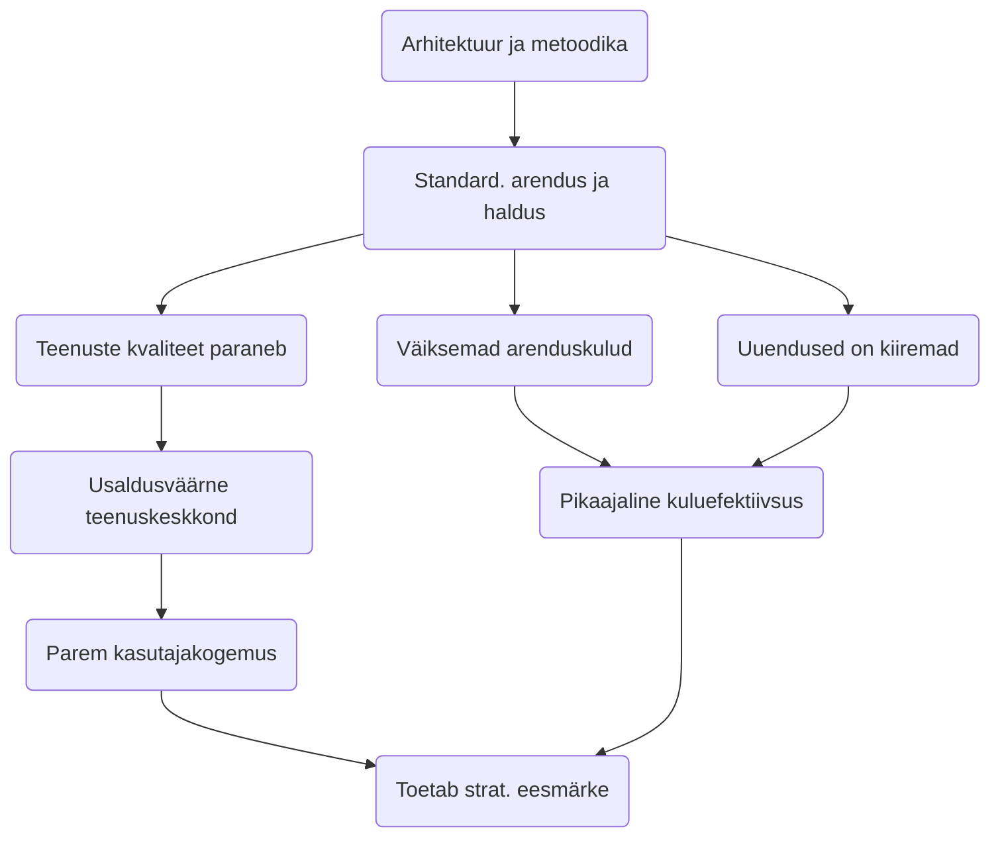

```mermaid
mindmap
  root((Arhitektuuriline lähenemine))
    Kasulikkus
      Juhtimistasand
        (Selge ülevaade teenuste toimimisest)
        (Kiire reageerimisvõime muudatustele)
      Kuluefektiivsus
        (Väiksemad hoolduskulud)
        (Korduvkasutatavad tööprotsessid)
      Teenuse kvaliteet
        (Väiksem katkestuste ja vigade risk)
        (Läbipaistvus ja usaldusväärsus)
    Jätkusuutlikkus
      Tehnoloogiline sõltumatus
        (Tootjavaba ülesehitus)
      Strateegiline paindlikkus
        (Uusi teenuseid saab lisada kiirelt)
        (Toetab pikaajalist arengut)
```

```mermaid
mindmap
  root((Arhitektuuriline standard))
    Mõjuvaldkonnad
      Äriline
        (Kulu vähendamine)
        (Riskide maandamine)
      Juhtimislik
        (Mõõdetavus)
        (Läbipaistvus)
        (Prognoositavus)
      Operatiivne
        (Kiire tarne)
        (Teenuste stabiilsus)
      Strateegiline
        (Skaleeritavus)
        (Tootjasõltumatus)
```

```mermaid
graph TD
  A(Arhitektuur ja metoodika) --> B(Standard. arendus ja haldus)
  B --> C1(Teenuste kvaliteet paraneb)
  B --> C2(Väiksemad arenduskulud)
  B --> C3(Uuendused on kiiremad)

  C1 --> D1(Usaldusväärne teenuskeskkond)
  D1 --> E1(Parem kasutajakogemus)
  E1 --> F(Toetab strat. eesmärke)

  C2 --> D2(Pikaajaline kuluefektiivsus)
  C3 --> D2
  D2 --> F
```
