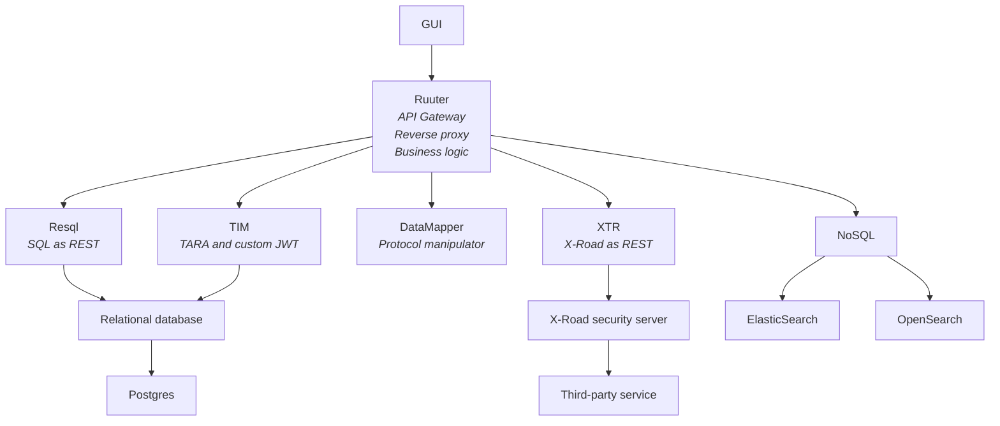

```mermaid
graph TD
  GUI[GUI]
  Ruuter[Ruuter<br><i>API Gateway<br>Reverse proxy<br>Business logic</i>]
  Resql[Resql<br><i>SQL as REST</i>]
  TIM[TIM<br><i>TARA and custom JWT</i>]
  DataMapper[DataMapper<br><i>Protocol manipulator</i>]
  NoSQL[NoSQL]
  RelDB[Relational database]
  XTR[XTR<br><i>X-Road as REST</i>]
  XRoadSecSer[X-Road security server]
  Third[Third-party service]

  GUI --> Ruuter

  Ruuter --> Resql
  Ruuter --> DataMapper
  Ruuter --> TIM
  Ruuter --> NoSQL
  Ruuter --> XTR

  Resql --> RelDB
  RelDB --> Postgres

  TIM --> RelDB

  NoSQL --> ElasticSearch
  NoSQL --> OpenSearch

  XTR --> XRoadSecSer
  XRoadSecSer --> Third
```
