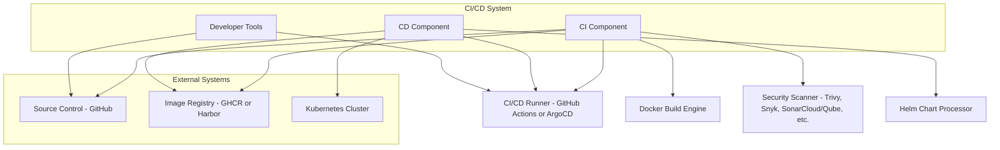

```mermaid
graph TD
  CI[CI Component]
  CD[CD Component]

  DevTooling[Developer Tools]
  SourceControl[Source Control - GitHub]
  CICDRunner[CI/CD Runner - GitHub Actions or ArgoCD]
  DockerEngine[Docker Build Engine]
  ScanEngine[Security Scanner - Trivy, Snyk, SonarCloud/Qube, etc.]
  Registry[Image Registry - GHCR or Harbor]
  Helm[Helm Chart Processor]
  Kubernetes[Kubernetes Cluster]

  CI --> SourceControl
  CI --> CICDRunner
  CI --> DockerEngine
  CI --> ScanEngine
  CI --> Registry

  CD --> Registry
  CD --> Helm
  CD --> CICDRunner
  CD --> Kubernetes

  DevTooling --> SourceControl
  DevTooling --> CICDRunner

  subgraph CI/CD System
    CI
    CD
    DevTooling
  end

  subgraph External Systems
    SourceControl
    Registry
    Kubernetes
  end
```
