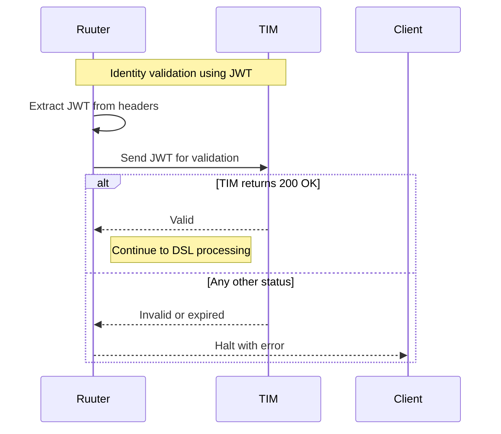

### JWT identity validation via TIM
After the request passes both Turvis and manifest validation, Ruuter extracts the JWT from the request headers and sends it to TIM for identity verification.

TIM is the only trusted authority allowed to validate JWTs. Ruuter does not attempt to decode or verify them on its own. If TIM returns anything other than HTTP 200, Ruuter stops processing and returns an error to the client.

This step ensures
- Every action is tied to a verified identity
- Centralized and controlled trust boundary for authentication
- JWTs are never assumed valid without external confirmation

