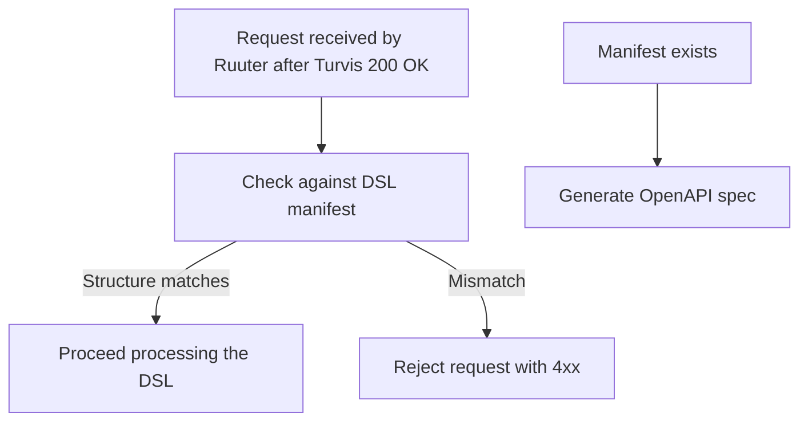

### Manifest validation and OpenAPI specification

Before executing any DSL-based logic, Ruuter validates the incoming request against the defined DSL manifest. This manifest specifies exactly which parameters are required, allowed, or forbidden. If the structure does not match 1:1, Ruuter rejects the request.

Additionally, if a manifest exists, Ruuter automatically exposes an OpenAPI spec based on the DSL. This ensures documentation, testing, and static analysis are always aligned with actual runtime behavior.

This step guarantees
- Rigid contract enforcement with no implicit assumptions
- Auto-generated API documentation directly from business logic definitions
- DSLs remain the only source of truth for endpoint structure and behavior

