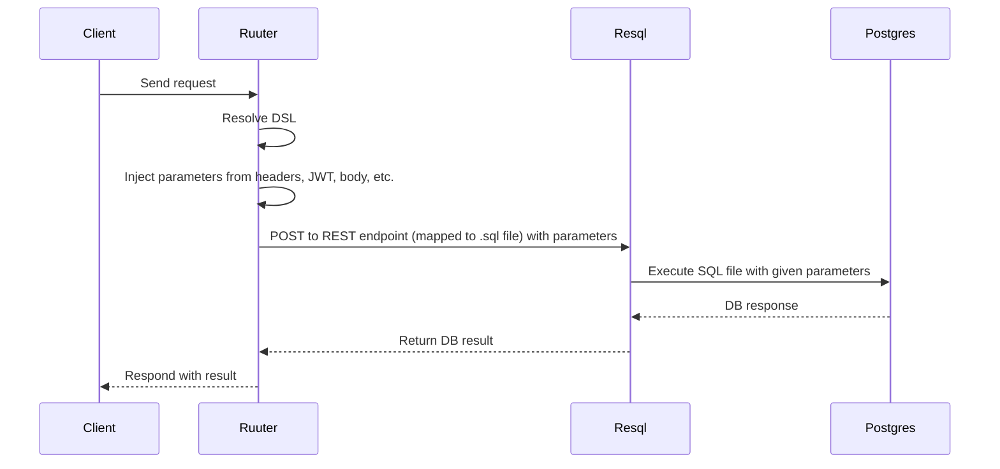

### Executing relational database operations

Although Resql also works standalone, then in production, Ruuter is responsible for executing all DSL-defined logic, including operations that target relational databases. These operations are described declaratively inside a DSL, and Ruuter is the only component allowed to interpret and initiate them.

When a relational database interaction is needed, Ruuter
- Resolves the corresponding DSL
- Extracts and injects parameters from
  - The request (query, body, headers)
  - The JWT
  - Predefined values in the DSL
  - Responses from earlier DSL steps
- Constructs a REST request to Resql, which acts as a proxy to the database
- Sends the request to Resql

Resql accepts the request as-is and forwards it to the database. It performs no validation or transformation.

This design ensures
- Relational data logic is always defined and controlled through the DSL
- Database access remains passive, isolated, and externally auditable
- No dynamic or uncontrolled queries are allowed in runtime code

