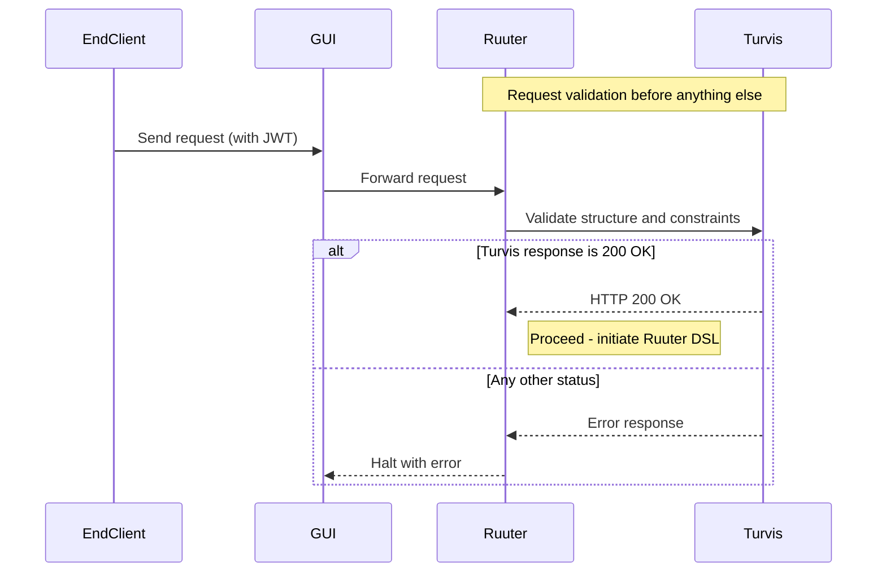

### Request validation via Turvis

Before any processing begins, Ruuter receives the request (from GUI) and, if defined so, performs a mandatory validation step via an external component called Turvis. Turvis verifies that the request is structurally and semantically acceptable.

If Turvis returns anything other than HTTP 200, Ruuter halts the process immediately.

This step ensures:

- Incoming requests are pre-validated externally;
- Ruuter avoids wasteful processing of malformed or unauthorized data;
- All other components can assume they only receive pre-approved input.

