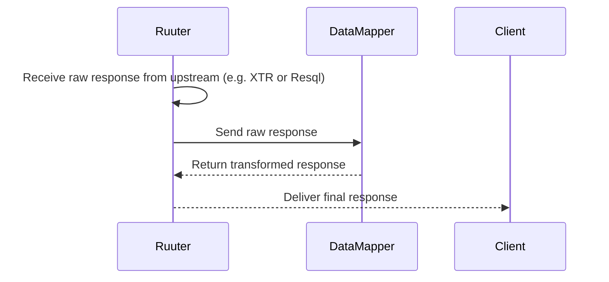

### Schema formatting / response transformation via DataMapper

Once Ruuter receives a response from any downstream system (e.g. Resql, XTR), it may need to transform or trim the response before returning it to the client. This transformation is handled by a passive component called DataMapper.

The DSL defines whether a response needs transformation. If so, Ruuter
- Sends the raw response to DataMapper
- Receives a trimmed, structured version suitable for the client

DataMapper performs no validation, enrichment, or lookups. It only
- Renames or filters fields
- Restructures or flattens nested data
- Ensures output aligns with what the client expects

This guarantees
- A clear boundary between raw data and presentation-ready data
- Reusable response mappings across different flows
- No coupling between backend response shape and frontend rendering logic

