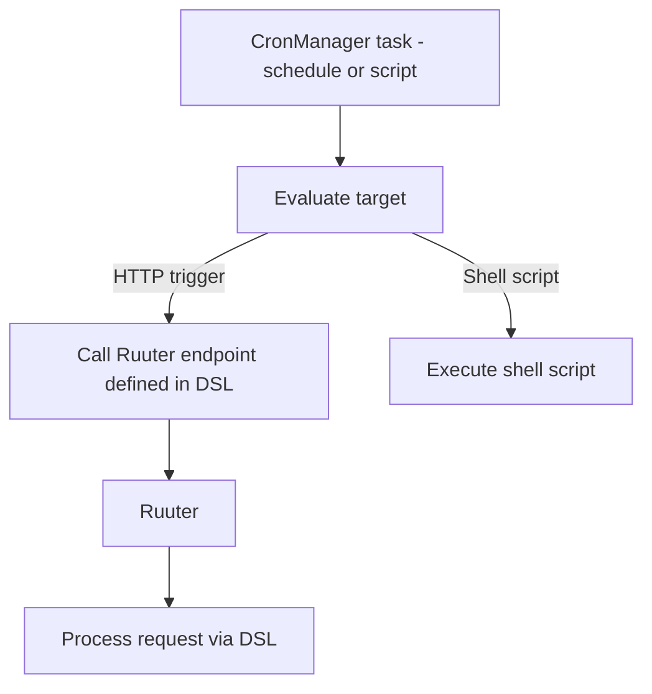

### Timed task execution via CronManager

CronManager is a standalone component responsible for executing scheduled tasks. It operates independently from the client or UI layers and is typically used for
- Triggering HTTP(S) requests to Ruuter-exposed DSL endpoints
- Executing `.sh` scripts or external system commands

CronManager is intentionally flexible and supports scripts or triggers defined in various languages and formats.

To maintain architectural control
- All service-internal operations must be routed through Ruuter
- No direct database access or internal service calls are allowed
- CronManager is treated as a trusted external client

This ensures
- Scheduling logic is decoupled from service logic
- DSL-based control and validation are preserved even in timed tasks
- Scripted execution remains observable and auditable

