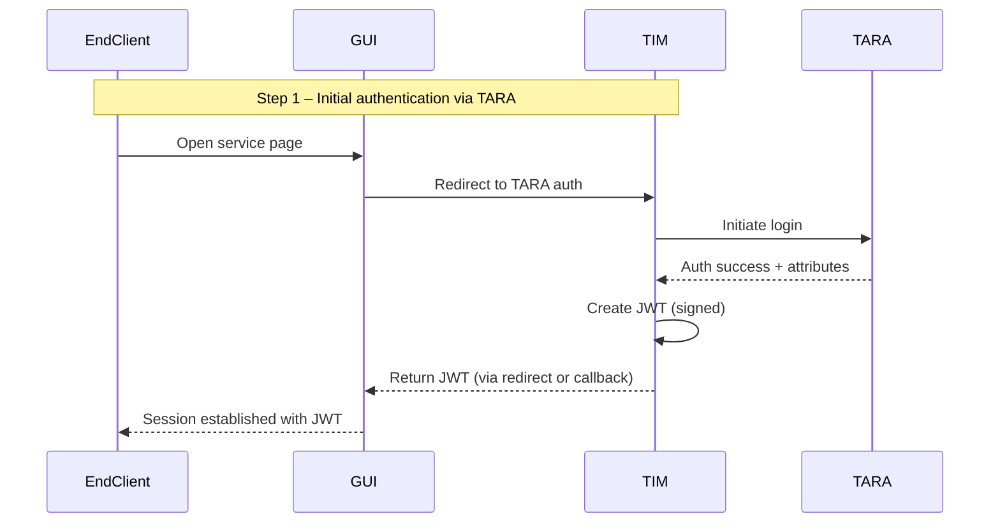

### Authentication and Identity Creation

The End Client authenticates via TARA, using a dedicated component called **TIM**. TIM handles the entire authentication flow and is solely responsible for issuing a signed **JWT** containing the End Client’s identity and personal attributes.

This JWT becomes the trusted identity token for all downstream steps. No other component is allowed to issue or alter it. The GUI receives this JWT and uses it in subsequent requests to the backend.

This flow ensures:

* Only authenticated users can proceed,
* Identity data is cryptographically verifiable,
* All later components can rely on Ruuter to extract and interpret the JWT.

