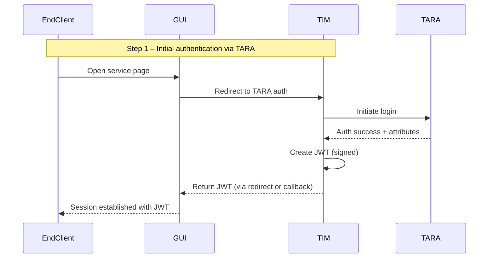

```mermaid
sequenceDiagram
    participant EndClient
    participant GUI
    participant TIM

    Note over EndClient, TIM: Step 1 – Initial authentication via TARA

    EndClient->>GUI: Open service page
    GUI->>TIM: Redirect to TARA auth
    TIM->>TARA: Initiate login
    TARA-->>TIM: Auth success + attributes
    TIM->>TIM: Create JWT (signed)
    TIM-->>GUI: Return JWT (via redirect or callback)
    GUI-->>EndClient: Session established with JWT
```
