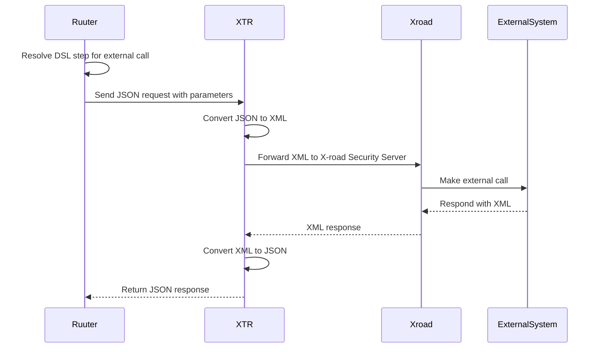

### X-Road queries via XTR

When the DSL defines a call to an external service available through X-road, Ruuter delegates the call to a component called XTR. XTR acts as a translator and connector between internal JSON-based logic and the XML-based structure required by X-road.

Ruuter constructs the outgoing request based on
- The current DSL step
- Injected parameters (headers, JWT, body, earlier responses)

XTR
- Converts the JSON payload into a valid XML format
- Calls the X-road Security Server using the required protocol
- Receives an XML response and transforms it back into JSON
- Ruuter then passes this JSON result to the next DSL step or to the client.

This guarantees
- Internal systems remain JSON-native
- All X-road protocol logic is isolated to a single passive component
- Ruuter retains full control of how and when external calls are made

